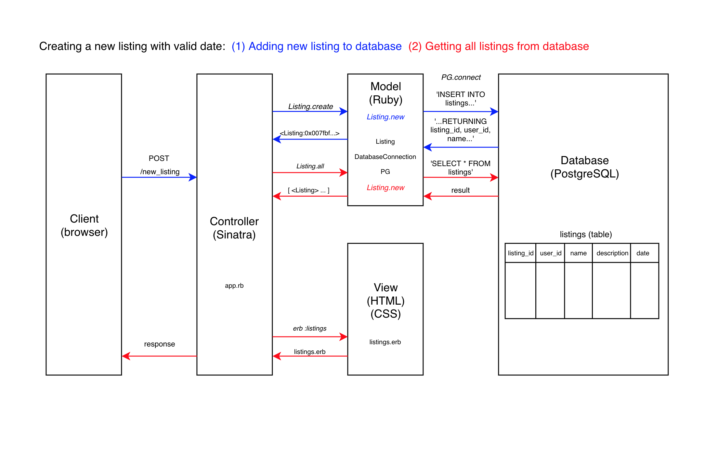

# MakersBnB

BnB listing and booking app built with Ruby, Sinatra, PostgreSQL

## User Stories

```
As a user
So I can use the site
I want to be able to sign up

As a returning user
So I can use the site again
I want to be able to log in

As a user
So no one else can use my account
I want to be able to log out

As a user
So I can have guests in my space
I want to be able to create a listing

As a host
So I can advertise my listing how I like
I want to be able to give the listing a name, description, and price

As a user
So I can choose where to stay
I want to be able to view all listings

As a host
So I can control when my space can be used
I want to say what dates my listing is available

As a guest
So I can stay for one night
I want to be able to request a listing for one night

```

## Future User Stories

```
As a host
So I can make decisions about my space
I want to be able to approve a request to stay

As a guest
So I can plan my stay
I want to know when a listing is unavailable

As a guest
So I can know my stay has been approved
I want to be able to confirm my booking after the host has approved my initial request

```

## Domain Model (to do - this is a placeholder!)


## How to use

### To set up the project

Clone this repository and then run:

```
$ bundle
```

### To set up the database

Run the Rakefile:

```
$ rake setup
```

### To run the MakersBnB app:

```
$ ruby app.rb
```

To view the app in a browser, navigate to `localhost` followed by the port (default is `4567`), e.g. `localhost:4567`.

### To run tests:

```
rspec
```

### To run linting:

```
rubocop
```

## Future updates

1. Implement remaining user stories
2. Improve CSS styling
